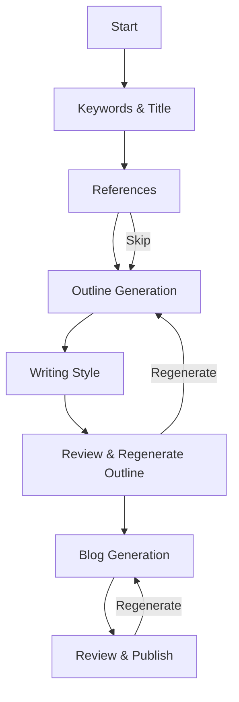

# Blog Generation Agent Mode Implementation

## Overview
This document outlines the implementation of the agent mode for blog generation, following the specified flow using LangGraph. The implementation will be broken down into key components and steps.

## Architecture

Note: This PoC now routes orchestration through LangGraph, introducing a KeywordResearchNode before outline planning. The node calls a local keyword tool (no external API), ranks/merges candidates, stores a research snapshot in state, and halts for user selection (primary then secondary) before proceeding.

### Core Components

1. **Agent State**
```typescript
interface AgentState {
  // Core Data
  data: BlogData;
  apiKey: string;
  
  // Flow State
  currentStep: 'keywords' | 'title' | 'outline' | 'writing_style' | 'review' | 'generation';
  
  // Keywords & Title
  primaryKeyword: string;
  secondaryKeywords: string[];
  titleOptions: string[];
  selectedTitle: string;
  
  // Outline
  outline: OutlineSection[];
  outlineFeedback: string;
  
  // Writing Style
  brandVoice?: string;
  blogGuidelines?: string;
  language: string;
  model: string; // e.g., 'gemini-pro', 'gpt-4', etc.
  
  // References
  referenceUrls: string[];
  uploadedFiles: File[];
  
  // Generation
  blogVersions: Array<{
    id: string;
    content: string;
    createdAt: Date;
    metadata: Record<string, any>;
  }>;
  
  // UI State
  isGenerating: boolean;
  error?: string;
  
  // Trace & Debug
  trace: Array<{
    step: string;
    timestamp: Date;
    data?: any;
  }>;
}
```

2. **LangGraph Workflow**



## Implementation Phases

### Phase 1: Keywords & Title (with KeywordResearchNode)

**Tools:**
- `keywordTool.getKeywordIdeas(seed, location)`: Local deterministic ideas with volume/difficulty
- `keywordTool.scoreIdeas(rows, title)`: Rank with score = 0.6*volume + 0.25*(1-difficulty) + 0.15*semanticMatch
- `generateTitles`: Generate title options based on primary keyword
- `selectTitle`: Store user's title selection

**Flow:**
1. User enters topic/title and target location
2. KeywordResearchNode derives seeds (user-provided + title-derived)
3. Calls keyword tool per seed, dedupes and ranks, then halts for primary selection
4. Runs secondary research for the chosen primary, halts for secondary selection
5. Stores selections and researchSnapshot in state
6. (Optional) Generate title options next

### Phase 2: References (Optional)

**Tools:**
- `addReferenceUrl`: Add a reference URL
- `uploadReferenceFile`: Upload a reference document
- `removeReference`: Remove a reference

### Phase 3: Outline Generation

**Tools:**
- `generateOutline`: Generate initial outline
- `editOutline`: Make manual edits to the outline
- `getOutlineFeedback`: Get AI feedback on outline

**Flow:**
1. System generates outline using primary keyword, secondary keywords, and references
2. User can edit outline structure
3. System provides feedback on outline quality
4. User approves outline

### Phase 4: Writing Style

**Tools:**
- `setBrandVoice`: Set brand voice guidelines
- `setBlogGuidelines`: Set specific blog guidelines
- `setModel`: Select LLM model
- `setLanguage`: Set output language

### Phase 5: Review & Regenerate Outline (Optional)

**Tools:**
- `regenerateOutline`: Regenerate outline with feedback
- `provideFeedback`: Provide feedback for regeneration
- `approveOutline`: Approve final outline

### Phase 6: Blog Generation

**Tools:**
- `generateBlog`: Generate full blog post
- `regenerateBlog`: Regenerate with different parameters
- `saveDraft`: Save current version as draft
- `publishBlog`: Publish the blog

**Flow:**
1. System generates blog content section by section
2. Each section is processed with SEO optimization
3. Internal links are added based on interlinks
4. References are properly cited
5. User can regenerate specific sections or the entire post

## API Endpoints

### GET /api/agent/keywords
- Search for keyword ideas
- Parameters: `query: string, location?: string, language?: string`
- Returns: `{ keywords: Array<{ keyword: string, volume: number, competition: string }> }`

### POST /api/agent/generate-titles
- Generate title options
- Parameters: `{ primaryKeyword: string, secondaryKeywords: string[], tone?: string }`
- Returns: `{ titles: string[] }`

### POST /api/agent/generate-outline
- Generate blog outline
- Parameters: `{ title: string, primaryKeyword: string, secondaryKeywords: string[], references?: Array<{ type: 'url' | 'file', content: string }> }`
- Returns: `OutlineSection[]`

### POST /api/agent/generate-blog
- Generate blog content
- Parameters: `{ outline: OutlineSection[], style: { brandVoice?: string, guidelines?: string, model: string, language: string }, references?: string[] }`
- Returns: `{ content: string, sections: Array<{ id: string, content: string }> }`

## UI Components

1. **AgentMode.tsx** - Main container component
2. **KeywordsExplorer.tsx** - For keyword research and selection
3. **TitleGenerator.tsx** - For title generation and selection
4. **ReferenceManager.tsx** - For managing reference URLs and files
5. **OutlineEditor.tsx** - For viewing and editing the outline
6. **StyleSettings.tsx** - For setting writing style preferences
7. **BlogPreview.tsx** - For reviewing and editing the generated blog
8. **PublishControls.tsx** - For saving and publishing options

## State Management

1. **Local State**: For UI-specific state (e.g., form inputs, loading states)
2. **URL State**: For deep linking and sharing (e.g., `/agent?step=keywords`)
3. **Persistence**: Auto-save to local storage and backend
4. **Undo/Redo**: Support for undoing actions

## Error Handling

1. **API Errors**: Display user-friendly error messages
2. **Validation**: Client-side validation for all inputs
3. **Recovery**: Auto-save and recovery of in-progress work
4. **Rate Limiting**: Handle API rate limits gracefully

## Testing Plan

1. **Unit Tests**: For individual components and utility functions
2. **Integration Tests**: For the LangGraph workflow
3. **E2E Tests**: For the complete user flow
4. **Performance Testing**: For large documents and many references

## Deployment

1. **Environment Variables**:
   - `NEXT_PUBLIC_API_URL`: Base URL for API requests
   - `GOOGLE_ADS_API_KEY`: For keyword research
   - `SUPABASE_URL` & `SUPABASE_KEY`: For persistence

2. **Build & Deploy**:
   ```bash
   npm run build
   npm run start
   ```

## Future Enhancements

1. **Multi-language Support**: For non-English content
2. **Collaboration**: Real-time collaboration features
3. **Templates**: Pre-defined templates for different blog types
4. **Analytics**: Track engagement and performance
5. **A/B Testing**: Test different versions of generated content
