# Enhanced Blog Generation Agent Flow

## 🎯 Overview
This document describes the enhanced agent flow implementation that provides a more granular, step-by-step approach to blog generation with user control at each stage.

## 📊 Complete Agent Flow

```mermaid
graph TD
    A[User Opens Agent Mode] --> B[User Provides Topic & Location]
    B --> C[Step 1: Keyword Generation - Primary]
    C --> D{User Selects Primary Keyword}
    D --> E[Step 2: Keyword Generation - Secondary]
    E --> F{User Selects 5 Secondary Keywords}
    F --> G[Step 3: Title Generation]
    G --> H{User Selects or Enters Title}
    H --> I[Step 4: Interlinking Optional]
    I --> J{User Adds Links or Skips}
    J --> K[Step 5: Reference Data Collection Optional]
    K --> L{User Adds References or Skips}
    L --> M[Step 6: Outline Creation]
    M --> N{User Reviews & Approves Outline}
    N --> O[Step 7: Section-by-Section Generation]
    O --> P[Step 8: Final Blog Generation]
    P --> Q[Complete Blog Ready]
    
    style C fill:#f9f,stroke:#333,stroke-width:2px
    style E fill:#f9f,stroke:#333,stroke-width:2px
    style G fill:#f9f,stroke:#333,stroke-width:2px
    style I fill:#9f9,stroke:#333,stroke-width:2px
    style K fill:#9f9,stroke:#333,stroke-width:2px
    style M fill:#ff9,stroke:#333,stroke-width:2px
    style P fill:#9ff,stroke:#333,stroke-width:2px
```



## 🔄 Detailed Flow Steps

### **Step 1: Primary Keyword Research** 🔍
**File:** `services/langgraph/agentGraph.ts` - `researchPrimaryNode()`

**What happens:**
- Agent extracts seed keywords from topic/title
- Calls keyword research tool for each seed
- Deduplicates and merges results
- Scores keywords based on:
  - Volume (60%)
  - Difficulty (25%)
  - Semantic match to title (15%)
- **HALTS:** `await_keyword_selection`

**User Action:**
- Reviews top 10 keyword candidates
- Clicks "Select" on desired primary keyword
- Sees volume and difficulty metrics

---

### **Step 2: Secondary Keyword Research** 🔍
**File:** `services/langgraph/agentGraph.ts` - `researchSecondaryNode()`

**What happens:**
- Uses selected primary keyword as seed
- Generates related keyword ideas
- Scores and ranks candidates
- **HALTS:** `await_secondary_selection`

**User Action:**
- Reviews up to 12 secondary candidates
- Selects up to 5 keywords via checkboxes
- Clicks "Confirm selection"

---

### **Step 3: Title Generation** 📝
**File:** `services/langgraph/agentGraph.ts` - `titleGenerationNode()`

**What happens:**
- Calls Gemini AI to generate 5 SEO-friendly title options
- Titles incorporate primary keyword naturally
- Titles are catchy and relevant to topic
- **HALTS:** `await_title_selection`

**User Action:**
- Reviews 5 AI-generated title options
- Clicks "Select" on preferred title, OR
- Enters custom title in text field

**Implementation:**
```typescript
export async function titleGenerationNode(s: AgentState): Promise<AgentState> {
  if (!s.data.primaryKeyword?.trim()) return s;
  
  const titles = await geminiService.generateTitles(s.data, s.apiKey);
  s.titleOptions = titles;
  s.halt = { reason: 'await_title_selection' };
  appendTrace(s, 'TitleGeneration.generated', { count: titles.length });
  return s;
}
```

---

### **Step 4: Interlinking (Optional)** 🔗
**File:** `services/langgraph/agentGraph.ts` - `interlinkingNode()`

**What happens:**
- Agent prompts user to add internal/external links
- These links will be contextually placed in blog content
- **HALTS:** `await_interlinking`

**User Action:**
- **Option 1:** Add internal/external links
  - Enter keyword/anchor text
  - Enter target URL
  - Click "Add"
  - Repeat as needed
- **Option 2:** Click "Continue (Skip if done)" to skip

**UI Features:**
- Add multiple links
- Remove links
- See list of all added links
- Skip entirely if not needed

---

### **Step 5: Reference Data Collection (Optional)** 📚
**File:** `services/langgraph/agentGraph.ts` - `referencesCollectionNode()`

**What happens:**
- Agent prompts user to add reference URLs
- References will be used during outline and content generation
- Gemini's `urlContext` tool will fetch content from URLs
- **HALTS:** `await_references`

**User Action:**
- **Option 1:** Add reference URLs
  - Enter URL (e.g., https://aws.amazon.com/rds/)
  - Click "Add" or press Enter
  - Repeat as needed
- **Option 2:** Click "Continue (Skip if done)" to skip

**UI Features:**
- Add multiple reference URLs
- Remove URLs
- See list of all added references
- Skip entirely if not needed

---

### **Step 6: Outline Creation** 📋
**File:** `services/langgraph/agentGraph.ts` - `discoveryNode()`

**What happens:**
- Uses all collected data:
  - Title
  - Primary & secondary keywords
  - Reference URLs (if provided)
- Calls Gemini AI to generate H2 and H3 outline
- Generates 5-10 H2 sections
- Each H2 has 3-5 H3 subsections
- Adds outline to draft as markdown
- Runs SEO estimator
- **HALTS:** `awaiting_approval`

**User Action:**
- Reviews outline in Live Draft panel
- Checks structure and topics
- Clicks "Approve outline" to proceed

---

### **Step 7: Section-by-Section Generation** ✍️
**File:** `services/langgraph/agentGraph.ts` - `proposalNode()`

**What happens:**
- Loops through each H2 section
- For each section:
  - Generates content with H3 subsections
  - Integrates primary keyword naturally
  - Adds internal links (interlinks)
  - Incorporates reference URLs
  - Adds inline citations [1], [2]
  - Creates "Sources" list at section end
- Validates reference usage (if policy requires)
- Appends section to draft
- Runs SEO estimator after each section
- **Continues until all sections complete**

**User Experience:**
- Sees draft grow section by section
- Live SEO score updates after each section
- Can see progress in trace panel

---

### **Step 8: Final Blog Generation** 🎉
**File:** `services/langgraph/agentGraph.ts` - `finalBlogGenerationNode()`

**What happens:**
- Generates complete, polished blog post
- Uses approved outline
- Applies all SEO best practices
- Ensures consistent tone and style
- Adds proper formatting
- Runs final SEO estimator
- **HALTS:** Done

**User Action:**
- Reviews complete blog in Live Draft
- Sees final SEO score
- Can copy or export content
- Can save to wizard for further editing

---

## 🎨 UI Components

### **Keyword Selection Panel** (Amber Background)
- Displays top keyword candidates
- Shows volume and difficulty metrics
- "Select" button for each candidate

### **Title Selection Panel** (Purple Background)
- Displays 5 AI-generated titles
- "Select" button for each title
- Custom title input field

### **Interlinking Panel** (Green Background)
- List of added links
- Input fields for keyword + URL
- "Add" and "Remove" buttons
- "Continue (Skip if done)" button

### **References Panel** (Yellow Background)
- List of added reference URLs
- Input field for URL
- "Add" and "Remove" buttons
- "Continue (Skip if done)" button

### **Outline Approval Panel** (Blue Background)
- Message to review outline
- "Approve outline" button

---

## 📁 File Structure

```
services/
├── langgraph/
│   └── agentGraph.ts         # Main agent orchestration
│       ├── researchPrimaryNode()
│       ├── researchSecondaryNode()
│       ├── titleGenerationNode()      ⭐ NEW
│       ├── interlinkingNode()         ⭐ NEW
│       ├── referencesCollectionNode() ⭐ NEW
│       ├── discoveryNode()
│       ├── proposalNode()
│       ├── finalBlogGenerationNode()  ⭐ NEW
│       └── route()                    ⭐ ENHANCED
│
├── geminiService.ts          # Gemini AI integration
│   ├── generateTitles()
│   ├── generateOutline()
│   ├── generateBlogPost()
│   └── rankBlogPost()
│
└── keywordService.ts         # Keyword research
    ├── getKeywordIdeas()
    ├── scoreIdeas()
    └── dedupeMerge()

components/
└── AgentMode.tsx             # Main UI component
    ├── Keyword panels         ⭐ ENHANCED
    ├── Title panel            ⭐ NEW
    ├── Interlinking panel     ⭐ NEW
    ├── References panel       ⭐ NEW
    └── Outline approval panel
```

---

## 🔧 Technical Implementation

### **AgentState Interface** (Enhanced)

```typescript
export interface AgentState {
  data: BlogData;
  apiKey: string;
  outline: OutlineSection[];
  outlineApproved: boolean;
  draft: string;
  messages: ChatMessage[];
  progress: { sectionIndex: number };
  policy: { referencesUsage: ReferencesUsage; grounding: boolean };
  trace: TraceItem[];
  halt?: { reason: string } | null;
  
  // ⭐ NEW: Keyword research
  keywordResearch?: {
    primaryCandidates?: KwRow[];
    secondaryCandidates?: KwRow[];
    snapshot?: Record<string, any>;
  };
  
  // ⭐ NEW: Title generation
  titleOptions?: string[];
  titleSelected?: boolean;
  
  // ⭐ NEW: Interlinking
  interlinkingCompleted?: boolean;
  
  // ⭐ NEW: References
  referencesCollected?: boolean;
  
  // ⭐ NEW: Final blog
  finalBlogGenerated?: boolean;
}
```

### **Routing Logic** (Enhanced)

```typescript
export function route(s: AgentState): RouteType {
  // Step 1: Primary keyword
  if (!s.data.primaryKeyword?.trim()) return 'research_primary';
  
  // Step 2: Secondary keywords
  if (!s.data.secondaryKeywords?.length) return 'research_secondary';
  
  // ⭐ Step 3: Title generation
  if (!s.titleSelected && !s.data.title?.trim()) return 'title_generation';
  
  // ⭐ Step 4: Interlinking (optional)
  if (!s.interlinkingCompleted) return 'interlinking';
  
  // ⭐ Step 5: References (optional)
  if (!s.referencesCollected) return 'references';
  
  // Step 6: Outline
  if (!s.outline?.length) return 'discover';
  
  // Step 7: Approval
  if (!s.outlineApproved) return 'await_approval';
  
  // Step 8: Sections
  if (s.progress.sectionIndex < s.outline.length && !s.finalBlogGenerated) 
    return 'proposal';
  
  // ⭐ Step 9: Final blog
  if (!s.finalBlogGenerated) return 'final_blog';
  
  return 'done';
}
```

---

## 🎯 Key Enhancements vs. Original Flow

| Feature | Original | Enhanced |
|---------|----------|----------|
| Keyword Research | Manual input | ✅ AI-powered with scoring |
| Title | User enters | ✅ 5 AI-generated options + custom |
| Interlinking | Before outline | ✅ Dedicated step with UI |
| References | Before outline | ✅ Dedicated step with UI |
| Generation | All at once | ✅ Section-by-section + final polish |
| SEO Scoring | Final only | ✅ Live after each section |
| User Control | Limited | ✅ Approval at each major step |
| Flexibility | Fixed flow | ✅ Optional steps (skip if needed) |

---

## 🚀 Usage Example

### **Complete User Journey:**

1. **User opens Agent Mode**
2. **Types:** "I want to write about AWS database services for cloud architects"
3. **Agent responds:** "Keyword candidates are ready..."
4. **User selects:** "database offerings by AWS" (Volume: 5400, Diff: 0.45)
5. **Agent responds:** "Secondary keyword candidates are ready..."
6. **User selects:** 5 secondary keywords
7. **Agent responds:** "Title options generated..."
8. **User selects:** "Complete Guide to AWS Database Services for 2024"
9. **Agent responds:** "You can now add internal/external links..."
10. **User adds:** 3 interlinks, clicks "Continue"
11. **Agent responds:** "You can add reference URLs..."
12. **User adds:** 2 AWS documentation URLs, clicks "Continue"
13. **Agent responds:** "Outline generated..."
14. **User reviews** outline, clicks "Approve outline"
15. **Agent generates** blog section by section (live updates)
16. **Agent responds:** "Blog generation complete!"
17. **User reviews** final blog with SEO score: 87/100

---

## 🔄 Backward Compatibility

✅ **Fully backward compatible** with wizard mode
- Wizard flow unchanged
- Agent mode is completely independent
- Shared data structure (BlogData)
- Can switch between modes anytime

---

## 📈 Benefits

1. **Better User Control:** User approves at each major step
2. **Higher Quality:** Step-by-step allows for corrections
3. **More Flexibility:** Optional steps can be skipped
4. **Better SEO:** Live scoring and keyword optimization
5. **Transparency:** Trace panel shows all steps
6. **User-Friendly:** Clear UI for each step

---

## 🎓 Developer Notes

### **Adding Custom Steps:**

To add a new step between existing ones:

1. **Add state field** in `AgentState` interface
2. **Create node function** (e.g., `customStepNode()`)
3. **Update route function** to include new step
4. **Update runNext()** to handle new route
5. **Add UI panel** in `AgentMode.tsx`
6. **Add halt reason** handler in `handleSend()`

### **Example:**

```typescript
// 1. Add to AgentState
customStepCompleted?: boolean;

// 2. Create node
export async function customStepNode(s: AgentState): Promise<AgentState> {
  // Your logic here
  s.halt = { reason: 'await_custom_action' };
  return s;
}

// 3. Update route
if (!s.customStepCompleted) return 'custom_step';

// 4. Update runNext
if (r === 'custom_step') {
  const ns = await customStepNode(s);
  return { state: ns, halted: true, step: 'custom_step' };
}

// 5. Add UI panel in AgentMode.tsx
{agent?.halt?.reason === 'await_custom_action' && (
  <div className="mb-4 p-3 border rounded bg-indigo-50">
    <div className="font-semibold mb-2">Custom Step</div>
    {/* Your UI */}
  </div>
)}
```

---

## 📝 Summary

The enhanced agent flow provides a comprehensive, step-by-step approach to blog generation with:
- ✅ AI-powered keyword research
- ✅ Multiple title options
- ✅ Optional interlinking step
- ✅ Optional references step
- ✅ Section-by-section generation
- ✅ Live SEO scoring
- ✅ Full user control

This implementation follows the flow diagram provided and maintains clean separation of concerns, making it easy to extend and customize.

